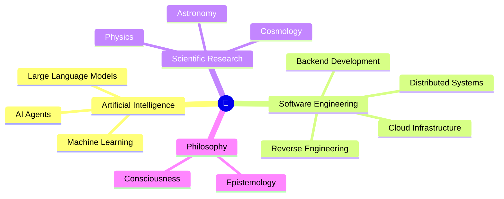

<h1>Hi, I'm Catyro 👋</h1>

<h3>AI • Machine Learning • LLM • Software Engineering</h3>

<i>"Curiosity drives everything I build."</i>

 

---

<h1>👨‍💻 About Me</h1>

I'm a developer passionate about understanding how technology works, from backend systems to artificial intelligence.

I enjoy building scalable software, experimenting with AI, and exploring the architecture behind modern applications.

Outside programming, I spend my time reading about philosophy, cosmology, and the nature of intelligence.

---

<h1>🛠 Tech Stack</h1>

<h3>AI & ML</h3>

<h3>Programming Languages</h3>

<h3>Backend</h3>

<h3>Frontend</h3>

<h3>DevOps</h3>

---

<h1>📈 GitHub Activity</h1>

  

---

<h1>🔬 Research Interests</h1>

> Exploring how intelligence, software, and the universe connect.

<h2>Currently Exploring</h2>

---

> Technology explains how things work.
>
> Philosophy asks why they exist.
>
> Cosmology asks where everything began.

---

---

<h3>Thanks for visiting my profile ⭐</h3>

